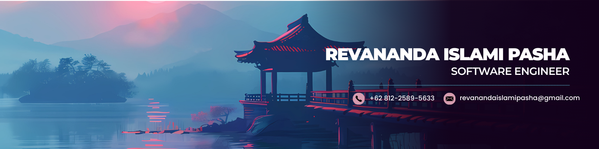

<h1 align="center">Hi 👋, I'm Revananda Islami Pasha</h1>
<h3 align="center">Software Engineer </h3>

  

## 📌 About Me
- 🎓 D3 Informatics Engineering Student at Politeknik Negeri Semarang (POLINES)
- 💻 Passionate about Backend Development and Cloud Computing
- 🚀 Currently learning Node.js, Express.js, React, Next.js, and Google Cloud
- 🤖 Building AI-powered applications using RAG and LLMs
- 🗄️ Interested in Databases, APIs, and System Design
- 🐧 Linux and Self-hosting Enthusiast
- 🌐 Love deploying and experimenting with backend infrastructure
- 📡 Exploring IoT with ESP32 and MQTT
- 🎮 Occasionally develop games using Unity
- 📚 Always learning new technologies and best practices

## 🧠 My Focus Areas
- Web Developer
- Cloud Engineer
- DevOps

## 📊 GitHub Stats & Trophies

  
  

  

  

## 🛠️ Languages & Tools

<h3 align="center">Programming Languages</h3>

  &nbsp;
  &nbsp;
  &nbsp;
  

<h3 align="center">Frontend</h3>

  &nbsp;
  &nbsp;
  &nbsp;
  &nbsp;
  &nbsp;
  

<h3 align="center">Backend</h3>

  &nbsp;
  &nbsp;
  &nbsp;
  

<h3 align="center">Database</h3>

  &nbsp;
  &nbsp;
  

<h3 align="center">DevOps & Cloud</h3>

  &nbsp;
  &nbsp;
  

<h3 align="center">Tools</h3>

  &nbsp;
  &nbsp;
  &nbsp;
  &nbsp;
  

  

## 🔗 Connect with Me

  &nbsp;
  &nbsp;
  &nbsp;
  

